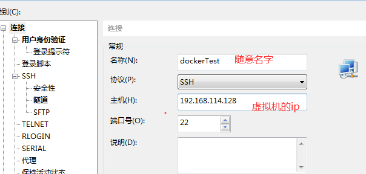

# Linux 的配置

可在VM或Oracle Vm上使用

#### 1导入Linux镜像文件

#### 2并且开启任务管理器的：DHCP

#### 开启后账户 root 密码 itcast

#### 3查看虚拟机ip地址

### 如果麻烦可以使用xShll来操作Linux

1.使用xshll前需要配置虚拟机网络

先看自己电脑使用什么网络再设置虚拟机的网络

​	桥接网络==选好网卡==接入网线

2.然后重新虚拟机网络

3.查询虚拟机ip

再看本机的ip地址

只要两个ip再同一网段就行了

# Docker安装

#### 注意：centos版本  uname -r查看

低于该版本则升级

### docker开启 停止 查看 进入命令

sysytemctl stop docker 停止

# 使用docker安装软件镜像

## 1 安装mysql镜像

.1先查看docker有没有安装mysql    （下面就是镜像安装好的mysql镜像  需要什么版本将他pull就行了）

（如果为无） 因为docker没有打开

再次搜索 将找到docker创库的mysql

.2下载**mysql**镜像  （镜像名字在**docker.io/**的后面）

3查看当前docker下载的镜像

- 4下载***指定版本***的mysql镜像

5想要删除镜像 （docker rmi  镜像的imageID）

# docker的容器命令操作

### 需要关闭虚拟机防火墙

**查看防火墙状态**

1docker运行mysql

**docker run --name aaa -d mysql：5.5**

aaa：自定义名字

-d：指在后台运行

mysql：运行的软件名字

5.5：版本号

**运行tomecat**

docker run -d -p 8888:8080 tomcat

-p:指定端口号

8888：虚拟机的端口

8080：tomcat的端口

2docker查看正在运行的软件

3.停止运行容器

# docker安装各种软件环境

